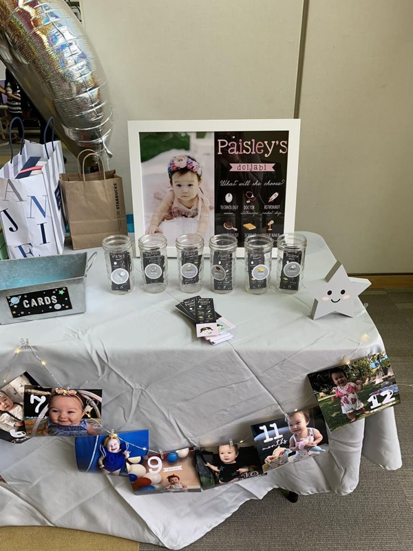

Paisley's 1st Birthday was October 13, 2017. It's been a while but I still wanted to share! We wanted her Birthday to be “Space theme.” Her middle name _is_ Nova, yanno? :)

**Venue:** Rowland Heights Community Center. It was a large occupancy room that has its’ own tables and chairs! (You just need to set it up the day yourself and put away.) They also have a full kitchen with giant fridges, an ice maker, and table top food warmers!

**Food:** We catered Korean food from Colima Catering in Rowland Heights and the food was bomb! We also catered kimbap (korean sushi) from Hmart in Diamond Bar (My mom picked that up since they don’t deliver.) We also catered from Portos!! MY FAVE! We had assorted sandwiches, salads, and fruit platters. (Thanks to my friends Sara & Matt who picked all that up!) Also kinda bummed cause I have zero pics of any of the food! :\*(

**Dessert:** Our 2-tier cake and cupcakes were made by our friends Arianne and Laurene. They were Funfetti flavor (Yum!) and our cupcakes had the most adorable swirl designs and silver sprinkles! Our cookies were made by Nicole @thecookiemunsters. Wow, she is so talented and can basically do any design! Go see for yourself on her IG. We also had ICE CREAM (my fave dessert, duh.) We filled a cooler with tiny individual servings of Ben & Jerry, Haagen Dazs tubs and bars. This was a huge hit for the guests!

**Decor:** Wow where do I begin. Ok. So the theme being “Space” was kinda hard because all inspo on Pinterest was showing mainly boy parties! Like whaaaatttt. So I wanted to make it fun and colorful cause girls can have Space parties too!

We set up all the decor on our own (backdrop, tables, easels etc.) I made the Balloon garland an hour before the party. Oh man I was stressin/sweatin. Give yourself more time if you’re gonna DIY a balloon garland lol. Or hire someone. Not me tho. lol

For the welcome table, we set up photos of Paisley from her 1st Birthday shoot we did with @the.mccunes. We are obsessed with them and couldn’t wait to have them on display! You MUST check out [McCune Photography](http://www.mccune-photography.com)! I decorated a card box with stickers, a light up sign, photos from months 1-12, and a big Moon balloon.

For the Dessert table, we borrowed cake stands and strung some rainbow christmas lights I had and laid down a floor mat from [Little Nomad](http://www.little-nomad.com). Dessert plates, napkins, and "one" cake topper were from Michaels. The cupcake toppers were from [Meri Meri](http://www.merimeri.com) but we added a few of our own too! I made mini pom poms with pipe cleaner halos to look like mini planets! My friends even made holographic stars. I also cut up tiny Paisley heads to tape to the astronauts. It ended up being such a cute personal touch.
I did my own floral arrangements. I bought most of the flowers from Trader Joes! My friend Nicole also grabbed some bunches for me from the Flower District in downtown la.

We even had a kiddie activity table (table and chairs rented from @meshkidsco) that my best friend Janet set up for me. It was fully stocked with Space themed crafts! There were coloring pages, books, dot markers, stickers, colored pencils, you name it. My fave was the “Make your own Constellation” where you stick on star stickers and connect them with colored pencil to make your own shape Constellations!

We spray painted a cardbaord Rocketship from [Oriental Trading](http://www.orientaltrading.com)

**Games:** The only game we did was the traditional Doljabi game where the baby “chooses” a profession and the guests guess which one. We set up raffle tickets and corresponding jars and guests added their ticket in whichever jar they thought Paisley would pick. For the different professions, we had a Rocket (Astronaut), Mic (Entertainer) , Book (Scholar), Hair Brush (Hair Stylist), Stethoscope (Doctor), and Computer Mouse (Computer Engineer). Paisley walked up to her choices and almost chose the Mic, but she ended up choosing the hair brush! Maybe she’ll be a hair stylist like me some day. haha!

**Vendors:** We had a huge space to work with so I wanted there to be lots of different activities. Lots of room for activities! Please tell me you know where that's from?! _Stepbrothers!_ Anyway, We had a Ball Pool from [Mesh Kids Co](http://www.meshkids.co) that was such a hit! All the little ones basically spent the entire time in there. We decorated with these cute space shuttle inflatables from [Oriental Trading](http://www.orientaltrading.com).

[Brass Street Photobooth](htp://www.brassstreetbooth.com) was set up in another corner and they are a modern open air booth so a lot of people can fit in a photo! Not only do they have a huge variety of cool backdrops, they customize your prints with your own graphic and print the photos right away.

Since we had a lot of kiddos, I also wanted to have a fun Balloon Artist. We hired someone from [Twist and Shout](http://www.twistandshoutevents.com) and they sent out Kyler. He was AMAZING! They offer so much more than just balloon artistry and they're super easy to book since it's all done online.

So much goes into planning a party. You can also hire someone to do all the work for you but I am crazy and picky so obviously, I had to run the show. As you can see, to put it all together takes a village!!! We had so much help from many friends and family members. We could not have done this alone and we are so very thankful!!!! We’ll definitely keep it more low key for Birthday #2. But really, will I? hahahahaha

**Some Deets:**

Paisley’s Dress: @sadiethenty Tiffany Confetti Dress rented from @theborrowedboutique

My dress: Xhiliration @target

Photo Booth: @brass.streetbooth

Ball Pit: @meshkidsco

Balloon Artist: @twistandshoutevents

Cookies: @thecookiemunster

Balloons: Balloons I used for the garland and big Moon [Bargain Balloons](http://www.bargainballoons.com)
